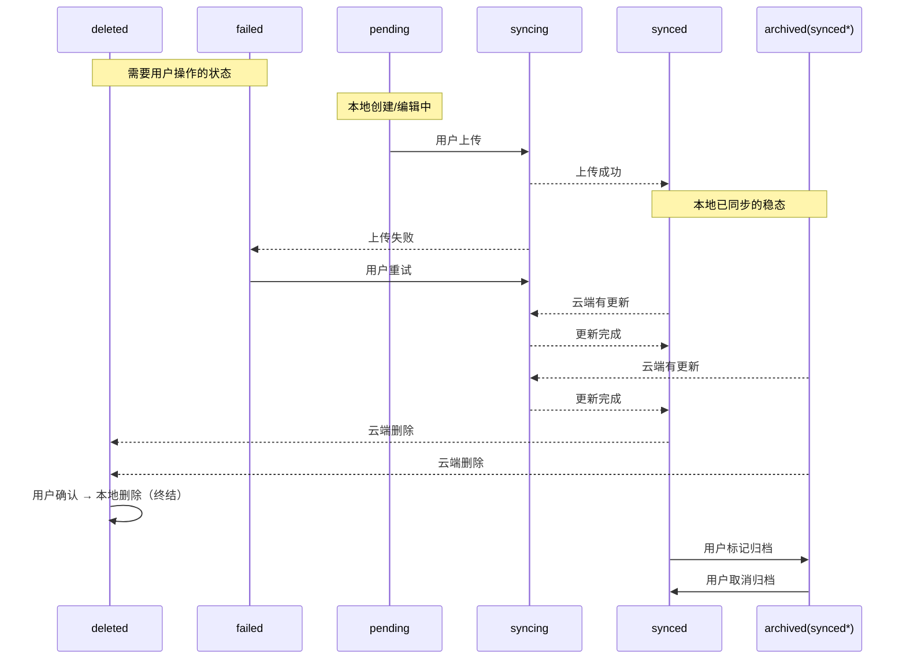

enum SyncStatus

打字梳理一下思路吧。
首先这个字段是本地的，标记的是一种状态，和云端的区别，或者是同步进度。

顺着数据的生命周期来看，初始本地新建一个数据，它的状态应该是 `pending`，表示“本地有更改，等待上传”。
当后台上传成功后，状态变成 `synced`，表示“已上传，服务端与本地一致”。
如果上传失败了，状态变成 `failed`，表示“上传失败”，需要用户主动触发重试。

稳态下：数据应该是 `synced` \ `failed` 两种状态。过程中会有 `pending` 、 `syncing` 状态。分别表示“等待上传”和“上传中”两种过程。
其次在多客户端场景下需要考虑的：
当本地存在一个标记为 synced 的数据，云端拉下来发现云端更新，那需要修改为 `syncing` 状态，需要拉取下来。
特殊的，当本地存在一个标记为 `synced` 的数据，云端拉下来没有这个数据，说明云端删除了这个数据，那么本地也需要删除这个数据。但是删除不应该自动执行，应当标记为一个特殊的 `deleted` 状态，等待用户确认删除，提供一种重新恢复数据的可能。（但是这里可能有权限问题，云端可能无法对一个没有授权记录的数据进行判断恢复，因为授权记录已经被删除了，所以大概率是只能禁止直接恢复数据，仅提供查看、彻底删除的选项。）

特别的，为了方便提供区分用户阅读进度的状态，`synced` 可以进一步被标记为 `archived` 状态，理解为 `synced` 下的一个子状态，表示“已归档”，方便用户区分阅读进度。

综上一共有以下状态：

```dart
enum SyncStatus {
  synced,      // 已上传，服务端与本地一致
  pending,     // 本地有更改，等待上传
  syncing,     // 上传中
  failed,      // 上传失败，等待重试
  deleted,     // 云端已删除，等待用户确认删除
  archived,    // 已归档（synced 的子状态）
}
```

可以画出其中状态机的序列图：


